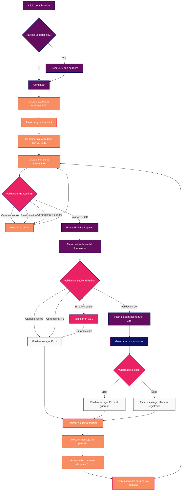

# Aplicación Web de Registro de Usuarios

**Reto Selección Becario ROMI.**

```Instrucciones
Construye una pequeña aplicación web o script en Python, HTML o Node.js (a tu elección) que registre usuarios (nombre, correo y contraseña) y los guarde en un archivo o base de datos simple (puede ser SQLite, JSON o CSV).
```

Esta es una aplicación web desarrollada en Python con Flask para registrar usuarios y guardarlos en un archivo CSV.


***Figura 1.** Pantalla principal*

## Estructura del Proyecto

```
reto-romi/
│
├── app.py                 # Servidor principal Flask
├── requirements.txt       # Dependencias
├── usuarios.csv          # Base de datos CSV (se crea automáticamente si es que aún no lo creaste)
├── templates/
│   └── index.html        # Template HTML principal
└── static/
    ├── css/
    │   └── styles.css    # Estilos CSS
    └── js/
        └── script.js     # JavaScript del frontend
```

## Instalación y Uso

### 1. Clona el repositorio desde tu terminal

```bash
git clone https://github.com/jesusvasquezjr3/reto-romi
```

### 2. Crea y activa tu entorno virtual
```bash
python -m venv reto-romi
```
```bash
.\reto-romi\Scripts\activate
```

### 3. Instala las dependencias
```bash
pip install -r requirements.txt
```

### 4. Ejecuta la aplicación
```bash
python app.py
```

### 5. Accede a la aplicación
Abre tu navegador y ve a: `http://localhost:5000` o bien en tu terminal deberá salirte el URL:


***Figura 2.** Ejemplo en terminal*

## Características

- **Modular**: Cada componente está separado en archivos diferentes
- **Responsivo**: El diseño se adapta a diferentes tamaños de pantalla
- **Validación**: Validación tanto en frontend como backend
- **Seguridad**: Las contraseñas se almacenan hasheadas para mayor seguridad, usando la librería **hashlib**
- **Centrado**: Todo el contenido está perfectamente centrado
- **Paleta de colores personalizada**: Usa colores con degradados

## Funcionalidades

- Registro de usuarios con nombre, correo y contraseña
- Validación de campos obligatorios
- Verificación de que el correo no esté duplicado
- Contraseñas mínimo 6 caracteres
- Mensajes de confirmación y error
- Almacenamiento en archivo CSV

## Personalización

### Colores
Los colores utilizados son:
- `#0D1164` (azul oscuro)
- `#640D5F` (morado)
- `#EA2264` (rosa)
- `#F78D60` (naranja)

Esta combinación de colores la obtuve con [https://colorhunt.co/palette/0d1164640d5fea2264f78d60](https://colorhunt.co/palette/0d1164640d5fea2264f78d60) para obtener un resultado más atractivo visualmente.

### Funcionalidad
- Backend: Edita `app.py`
- Frontend: Edita `templates/index.html`
- JavaScript: Edita `static/js/script.js`

#### Esquema de Funcionamiento


## Archivo CSV

Los usuarios se guardan en `usuarios.csv` con las siguientes columnas:
- `nombre`: Nombre completo del usuario
- `correo`: Correo electrónico (único)
- `password_hash`: Contraseña hasheada con SHA-256
